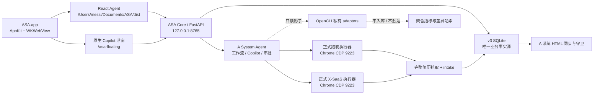

# ASA App Kimi 接手说明

更新时间：2026-07-22  
适用范围：ASA 原生 macOS App、React Agent 前端、ASA Core、Copilot/工作流、猎聘与 X-SaaS 寻访、OpenCLI 影子链路、A 系统 v3 数据同步。

## 1. 先看结论

ASA 已经不是演示页面，而是一套正在读写真实猎头业务数据的本机 Agent App。

当前主链路可用：

- 原生 macOS App 正在运行，版本 `0.2.18 (41)`。
- React 前端通过 ASA Core 的 `/asa-app` 路由加载，不再把 Web 页面作为正式产品入口。
- ASA Core 正在 `127.0.0.1:8765` 运行并连接 A 系统 v3 SQLite 数据库。
- 岗位、候选人、工作流、审批、候选人动作、审计、Copilot 都有真实 API 和真实数据。
- 猎聘与 X-SaaS 是正式多渠道寻访执行器；外部寻访必须经过一次性 R3 审批。
- OpenCLI 已接入，但当前只做只读影子对照和页面状态读取，不参与正式入库、触达或写库。

当前最需要优化的不是重新做一个页面，而是：

1. 先建立可靠的 Git 基线和自动化测试基线。
2. 把工作流的业务状态讲清楚，避免把“人数不足待复核”显示成系统故障。
3. 拆分过于集中的 React 单文件，补齐强类型、组件测试和 App 端 E2E。
4. 继续提高猎聘/X-SaaS 详情抓取完整率与执行可观测性。
5. OpenCLI 继续观察，达到迁移门槛后再做独立行动试点，不能直接替换正式链路。

## 2. 产品定位

ASA 是本机运行的猎头 Agent 工作台，不是通用聊天机器人，也不是传统网页后台。

正式使用场景：

- 查看 A 系统岗位、优先级和人才漏斗。
- 查看候选人与岗位关系、完整履历、来源链接和业务时间线。
- 对候选人执行复核通过、已联系、已推荐、停止推进等真实业务动作。
- 从岗位上下文发起多渠道寻访工作流。
- 通过 Copilot 记录跟进事实、创建工作流、解释当前状态。
- 在猎聘/X-SaaS 登录态下执行召回、完整简历抓取、排重、入库和评估。

用户已经明确：产品以 App 为主，不再继续发展一个独立 Web 产品。浏览器端仍是猎聘/X-SaaS 执行环境和开发调试环境，不是正式入口。

### 2.1 用户已经明确的体验偏好

- 优先优化现有 ASA App，不重新另起产品或营销式首页。
- 工作流名称要短、可扫描，一眼看出客户、岗位、轮次和动作。
- 人选详情首先保证内容完整和易读，不要只优化外观。
- 来源简历/档案跳转必须直接可见。
- 履历按主体分组，每段带时间的经历必须另起一行。
- 高频跟进操作要一步完成，不再拆成复杂的“更新情况 + 更新备注”双流程。
- 点击停止、审批、重试等动作必须立即有 loading、确认、成功或失败反馈，不能静默无反应。
- 工作流应使用业务语言解释“完成、待复核、人数不足、渠道异常”，避免直接把内部技术状态扔给用户。
- 视觉上保持克制、工作台导向和高信息密度；不要卡片套卡片，也不要把运营工具做成营销页。

## 3. 当前架构



### 3.1 React Agent 前端

根目录：`/Users/messi/Documents/ASA`

关键文件：

| 文件 | 作用 |
| --- | --- |
| `src/main.tsx` | 当前全部主界面、详情、工作流、Copilot，约 663 行 |
| `src/api.ts` | 手写 API 类型和请求封装 |
| `src/generated/api.d.ts` | 从 OpenAPI 生成的类型，目前没有真正接管手写类型 |
| `src/styles.css` | 全局样式和响应式规则，约 132 行，但包含大量压缩成单行的 CSS |
| `tests/test_candidate_action_dialog.py` | 候选人动作确认层回归 |
| `opencli/` | OpenCLI 私有 adapters、只读 A/B 与影子模式文档 |

技术栈：React、TypeScript、Vite、Lucide。

注意：`package.json` 依赖使用 `latest`，虽然 `package-lock.json` 当前能固定安装结果，但升级时仍有漂移风险。

### 3.2 原生 macOS App

源码：

`/Users/messi/Documents/Codex/2026-06-18/liepin-intelligence/asa-floating-app`

安装位置：

`/Users/messi/Applications/ASA.app`

当前版本：`0.2.18`，构建号 `41`。

核心实现：`asa-floating-app/src/AppDelegate.swift`

原生壳负责：

- `ASA Agent` 主窗口，加载 `http://127.0.0.1:8765/asa-app`。
- `ASA Copilot` 常驻浮窗，加载 `/asa-floating`。
- 菜单栏入口、主窗口和浮窗显示/收起。
- 原生上下文桥接 `window.webkit.messageHandlers.asaNative`。
- 当前前台应用/窗口上下文、截图、OCR、剪贴板附件等系统能力。
- 快捷键，包括 `Option+Space` 及备用组合键。
- Core 不在线时尝试恢复服务并显示诊断页。

### 3.3 ASA Core

源码：

`/Users/messi/Documents/Codex/2026-06-18/liepin-intelligence/scripts/asa_core`

核心文件：

- `app.py`：FastAPI 路由、幂等写入、App 专用静态路由。
- `service.py`：岗位、候选人、工作流、Copilot 和候选人动作业务逻辑。
- `database.py`：数据库连接、事务、迁移、来源链接和审计治理。

服务由 LaunchAgent 管理：

- Label：`ai.hermes.liepin-workbench`
- 地址：`http://127.0.0.1:8765`
- 日志：`/Users/messi/.hermes/logs/liepin_workbench_server.log`
- 错误日志：`/Users/messi/.hermes/logs/liepin_workbench_server_error.log`

### 3.4 A 系统事实源

唯一业务事实源：

`/Users/messi/Documents/Codex/2026-06-26/re/outputs/talent_system_v3_20260629.db`

不要创建第二份业务数据库，不要只改 HTML，也不要把搜索报告当作最终状态。

当前 API 快照：

- 活跃岗位：35
- API 可见岗位：132
- 候选人岗位关系：114
- 待处理候选人：65
- 待审批：0
- 数据库 `jobs` 总数：137
- 候选人事件：522

API 会过滤归档/只读快照等记录，因此 API 岗位数和数据库总数不必相同。

## 4. 当前 App 功能

### 4.1 四个主导航

必须保持恰好四个主导航：

1. `总览`
2. `岗位看板`
3. `人选进度`
4. `人选列表`

不要重新引入一排辅助主导航。低频审计入口目前是侧栏底部的 `审计与旧版`。

### 4.2 总览

当前展示：

- 活跃岗位、候选人关系、待处理、待审批。
- 当前工作流，支持打开和归档。
- 优先岗位。
- 最近更新候选人。

数据每 2 秒轮询一次；窗口重新聚焦或恢复可见时也会刷新。

### 4.3 岗位看板与岗位详情

支持：

- `P0 / 在推 / 全部` 三种范围。
- 搜索客户、岗位和状态。
- 优先级、生命周期、地点、活跃候选人数。
- 岗位详情中的漏斗、岗位概况、硬性要求、核心能力、岗位卖点。
- 目标公司、排除条件、阶段分布、关键词、风险、寻访实验。
- 岗位候选人、待办和最近动态。

### 4.4 人选进度与人选列表

支持：

- 按 `flow_bucket`/阶段分组查看进度。
- `待处理 / 全部 / 已停止` 三种候选人范围。
- 姓名、公司、职位、岗位、客户和渠道搜索。
- 从进度、列表、岗位或工作流精确打开同一条 `job_candidate` 详情。

### 4.5 候选人详情

当前固定三标签：

- `概览`
- `履历`
- `记录`

已支持：

- 候选人身份、当前公司/职位/城市、目标岗位、阶段、经验/学历。
- 猎聘简历或 X-SaaS 档案跳转链接。
- 职业概览、求职意向和关键词。
- 工作、项目、教育经历时间线。
- 同一公司/学校经历合并展示，但每个带时间的经历单独一行。
- 完整原始履历折叠区。
- 岗位关系、业务时间线、寻访关键词和后续学习分。
- `复核通过 / 已联系 / 已推荐 / 停止` 真实业务动作。

候选人动作必须走：

`preflight -> 页面内确认 -> commit -> 审计/事件/学习反馈 -> 原地刷新`

候选人动作接口使用一次性、5 分钟有效的预检 token；写请求带 `Idempotency-Key`。

### 4.6 工作流详情

支持：

- 工作流进度、当前步骤、运行时长和审批等待时间。
- 岗位目标、结构化寻访策略、关键词、排除规则和复核门槛。
- 本轮新增候选人和岗位已评估候选人分开展示。
- 0 新增但已有 6 位评估结果时，仍显示 6 张可点击人选卡。
- 步骤详情、失败步骤重试、审批、取消、归档和修改计划。
- 正式外部寻访审批前展示前后影响。
- OpenCLI 影子对照的简要结果，明确标注未参与入库。

### 4.7 Copilot

React App 和原生浮窗共用 ASA Core/A System Agent 能力。

当前能力：

- 页面、岗位、候选人、工作流上下文。
- 会话 ID 保存在 `localStorage`。
- 持久化 `business_focus`，包括客户、岗位、候选人、动作、方向和冲突。
- 回答中可以返回打开/启动工作流的动作按钮。
- 高置信岗位上下文下，明确“可以搜索”可以创建并自动运行内部步骤到外部审批。
- 绝不允许只说“开始执行”而没有真实 `workflow_id`。

明确候选人上下文下，以下短指令会直接写真实业务状态：

- `这个人选复核通过`
- `这个人选已联系`
- `这个人选已推荐给客户`
- `这个人选复核不通过/停止推进`
- `这个人选已读不回` 或明确记录/备注已读未回复

询问句如“已读不回怎么办”只回答，不写入。

## 5. API 边界

正式 v1 API：

- `GET /api/v1/health`
- `GET /api/v1/bootstrap`
- `GET /api/v1/dashboard`
- `GET /api/v1/jobs`
- `GET /api/v1/jobs/{job_id}`
- `GET /api/v1/candidates`
- `GET /api/v1/candidates/{candidate_id}`
- `GET /api/v1/workflows/{workflow_id}`
- `GET /api/v1/audit-events`
- `GET /api/v1/events`
- `POST /api/v1/copilot/messages`
- `POST /api/v1/workflows`
- `POST /api/v1/workflows/{workflow_id}/{action_name}`
- `POST /api/v1/approvals/{approval_id}/decision`
- `POST /api/v1/candidate-actions/preflight`
- `POST /api/v1/candidate-actions/commit`

前端还会调用兼容层接口：

- `/api/agent/copilot/session`
- `/api/agent/steps/{id}/retry`
- `/api/asa/floating/context`

`/asa-app` 只允许 `User-Agent` 以 `ASAApp/` 开头的请求，普通浏览器访问会返回 403。这只是本机 App 路由约束，不应被当成强认证机制。

## 6. 候选人状态和不可破坏的规则

### 6.1 停止就是淘汰/关闭

以下任一条件都代表已停止：

- `H5 最近寻访/初筛不通过`
- latest review = `stop`
- `raw_status` 为 `screen_rejected/xsaas_review_stop/rejected/stopped/closed`
- 文案包含停止、淘汰、不推进或关闭

停止后必须：

- 保留历史记录。
- 不计入待处理/待跟进。
- 不被 DB doctor、同步脚本或后续 Copilot 重新推进。
- 重复停止和直接重新推进返回冲突；重新启用只能走明确的人工状态纠正。

### 6.2 阶段不能倒退

- 已联系不能被低风险备注降回待复核。
- 已推荐、面试、Offer 等后续阶段记录“已读未回复”时只补事件和备注，不降到 S3。
- 重复 `advance/contact/recommend` 应幂等返回，不重复写业务事件。

### 6.3 来源身份

- `job_candidates.source_candidate_id` 在存在本地候选人时必须使用 v3 `candidates.id`。
- 猎聘 `res_id_encode`、resume ID、X-SaaS person ID 和 URL 是来源证据，保存在 `source_profiles`、`entity_source_links` 或事件中。
- 不得把外部 ID 再写成同岗位第二条 `job_candidates`，否则会导致候选人定位歧义。

### 6.4 遮罩名合并

- `**`、某、先生、女士、老师都按遮罩名处理。
- 同姓不能自动合并。
- 遮罩名需要姓氏一致，并且公司和职位证据同时匹配。
- 合并必须经过只读预检和一次性确认，保留双方来源简历、关系、事件、任务、反馈和审计。

## 7. 正式寻访链路

标准链路：

1. 从 v3 岗位库解析唯一客户和岗位。
2. Copilot 创建真实 `workflow_id`。
3. 内部执行岗位诊断、历史人才库排重、策略生成。
4. 到猎聘 + X-SaaS 外部寻访前生成一次性 R3 审批。
5. 用户批准后调用正式渠道执行器。
6. 搜索列表只做召回，不直接入库。
7. 逐一打开详情页抓取完整简历。
8. 只有 `resume_capture_status=complete` 才允许 intake。
9. 排重后写 `candidates/job_candidates/source_profiles/entity_source_links/candidate_events`。
10. 自动评估并在工作流展示“本轮新增”和“岗位已评估”。
11. 同步 A 系统、重算指标、审计和回归守卫。

完整简历最低要求：

- `full_text`
- `work_text`
- `project_text`
- `education_text`
- 来源 URL/来源 ID

`partial` 或 `failed` 不能用搜索卡片摘要冒充完整履历，更不能覆盖已有完整档案。

### X-SaaS 的特殊边界

- X-SaaS 能做召回、复核和入库。
- X-SaaS 不能代表猎聘触达。
- X-SaaS 复核通过使用 `X2 X-SaaS复核通过/待人工联系`。
- 后续显示 `待人工联系/转猎聘或微信`，不能标记为猎聘 `job_chat_verified`。

## 8. OpenCLI 当前真实状态

OpenCLI 私有 adapter 源码：

- `opencli/clis/liepin/candidate-search.js`
- `opencli/clis/xsaas/candidate-search.js`

安装目标：`~/.opencli/clis/...`

当前生产契约：

```json
{
  "mode": "read_only_shadow",
  "affects_intake": false,
  "affects_outreach": false,
  "sample_policy": "first_query_per_channel"
}
```

正式链路仍由现有猎聘/X-SaaS runner 执行。OpenCLI 在正式文件生成后抽样第一条查询，随后复用生产详情抓取函数检查完整简历，并只记录聚合指标和差异哈希。

影子产物严禁保存姓名、外部 ID、URL、简历正文或 CDP 会话值。

2026-07-21 A/B 结果：

- 猎聘：两边 3/3 成功、10/10 重合，OpenCLI 约快 37%。
- X-SaaS：两边 3/3 成功、30/30 重合，OpenCLI 约快 18%。
- 稳定性和相对召回只是持平，不是严格更优，所以迁移门槛仍关闭。

任何正式动作迁移必须同时满足：

1. OpenCLI 稳定性严格更高。
2. 相对召回严格更高。
3. 字段/履历完整率不差。
4. 继续复用 ASA 的审批、排重、intake、归因和审计。
5. 先做独立行动试点，不能一次性替换正式执行器。

## 9. 当前运行状态与可复现样本

### 士兰微岗位 #154

岗位：`士兰微｜技术市场经理/总监（PC电源）`

当前有 6 条岗位候选人关系：

- 4 条 `S1 新增寻访/待复核`
- 1 条 `S3 已联系/待回复`
- 1 条 `H5 最近寻访/初筛不通过`

最近三轮工作流：

- `workflow_ba826dbdccf0`：第 1 轮，已完成。
- `workflow_1c5ce2e05b53`：第 2 轮，步骤完成但合格人数不足，当前为业务 `blocked`。
- `workflow_1076e0e1d5d5`：第 3 轮，步骤完成但 0 位高分、5 位待核验，当前为业务 `blocked`。

第 3 轮不是技术报错。工作流 5/5 步完成，猎聘读取到 5 位已有候选人，X-SaaS 本轮返回 0，intake 新增 0；最终因为目标人数没有达到而进入业务阻塞。

### 候选人 #563 唐**

用于验证停止链路：

- 当前状态：`H5 最近寻访/初筛不通过`
- `raw_status=screen_rejected`
- 事件：`resume_review_completed / stop`
- 已写 `candidate.commit` 审计和 1 条 stopped 学习反馈。
- 重复停止预检返回 409，不重复写事件。

### 候选人 #564 邓先生

用于验证低风险跟进记录：

- 当前状态：`S3 已联系/待回复`
- 已记录 `read_no_reply`/已读未回复。
- 此事实通过 Copilot 一步写入，不需要再填写复杂“更新情况 + 更新备注”。

## 10. 已经修复和固化的用户问题

| 用户问题 | 当前状态 |
| --- | --- |
| Copilot 说开始寻访但没有真正执行 | 已要求执行性回答必须有真实 `workflow_id` |
| 用户说“可以搜索/可以”后推动不下去 | 高置信岗位焦点下会创建新工作流并自动运行内部步骤到审批 |
| 工作流名字太长、难识别 | 已改为 `客户｜岗位｜第 N 轮寻访 · 目标人数` |
| 工作流显示 6 位人选但不知道在哪看 | 已显示本轮新增与岗位已评估卡片，可点击打开详情 |
| 人选详情缺内容和来源跳转 | 已增加来源链接、详情回退和历史档案修复 |
| 人选详情排版不易读 | 已改为概览/履历/记录三标签和结构化时间线 |
| 同一公司的多段履历挤在一行 | 已按公司分组，每个带时间经历独立一行 |
| 新寻访的简历可能只有列表摘要 | 正式 intake 前强制抓详情，非 complete 拒绝入库 |
| OpenCLI 没有进入寻访链路 | 已进入只读影子链路，但明确不参与正式写入 |
| 更新情况和备注操作太复杂 | 明确已读未回复等低风险事实可通过 Copilot 一步记录 |
| App 点击停止没有效果 | 已移除 WKWebView 不支持的原生 `confirm()`，改为 App 内确认层并真实验证 |

## 11. 已知问题和技术债

### P0：接手前先处理

#### 11.1 ASA 前端仓库没有首个提交

当前 `/Users/messi/Documents/ASA` 的 `main` 分支没有任何 commit，主要文件全部显示为 untracked。

这意味着：

- 没有可靠历史可回滚。
- Kimi 大范围重构前无法准确区分现状和新改动。
- `git diff` 对当前文件没有正常基线价值。

第一步应在确认敏感/运行时目录已忽略后建立基线提交。特别注意 `opencli/chrome-profile` 是运行时浏览器资料，不应提交。

#### 11.2 前端单文件过重

`src/main.tsx` 同时包含：

- App 状态与轮询
- 四个主页面
- 岗位详情
- 候选人详情
- 工作流详情
- Copilot
- 大量数据格式化逻辑

当前约 663 行，许多 JSX 是单行压缩写法。`src/styles.css` 也有大段单行 CSS。这会放大任何 UI 改动的回归风险。

建议按 `app/pages/panels/workflows/copilot/shared` 拆分，但必须先补测试，不能边拆边改变业务语义。

#### 11.3 工作流“修改计划”仍使用浏览器 `prompt()`

候选人停止曾经失败的根因是 WKWebView 没有实现 JavaScript 对话框代理。候选人动作已经换成 App 内确认层，但工作流 `修改计划` 仍调用：

```ts
prompt('输入计划修改意见')
```

这在原生 App 中很可能同样无效。应改为 React 内部编辑对话框，并补 App 端 E2E。

#### 11.4 “blocked” 混合了技术失败和业务未达标

当前第 2、3 轮寻访都是 100% 步骤完成，但因合格人数不足显示 `blocked / 工作流需要处理后继续`。

用户会误以为执行失败。建议增加业务终态：

- `completed_target_met`
- `completed_needs_review`
- `completed_pool_insufficient`
- `failed_technical`

或至少在前端根据 goal error/result summary 映射成明确中文，并提供 `复核现有人选 / 调整条件再搜 / 结束本轮` 三个动作。

### P1：近期优化

#### 11.5 类型系统没有真正落地

- `src/api.ts` 和 `main.tsx` 当前约有 38 个 `any`。
- 已生成 `src/generated/api.d.ts`，但实际请求仍使用手写松散类型。
- 工作流输出大量依赖 `Record<string, any>` 和运行时猜字段。

建议建立 typed client 和 schema adapter，先从 dashboard、workflow、candidate action 三个高频接口开始。

#### 11.6 前端测试不足

当前 ASA 目录 17 项测试通过，但主要是：

- 候选人确认层源码契约测试。
- OpenCLI A/B 归一化和 X-SaaS parser 回归。

缺少：

- React 组件行为测试。
- 工作流状态映射测试。
- App `/asa-app` 端到端测试。
- 候选人动作取消/失败/成功的真实浏览器自动化测试。
- 桌面和窄窗口截图回归。

测试应使用临时数据库副本，不能在自动测试中修改正式 v3 DB。

#### 11.7 轮询和全量刷新较重

- dashboard 每 2 秒请求一次。
- 活跃工作流每 1.2 秒请求一次。
- 候选人详情变化会触发完整 bootstrap/jobs/candidates 刷新。

数据量继续增长后会产生重复 SQLite 查询和 React 重绘。可考虑事件版本号、增量接口、SSE 或降低非焦点轮询频率。

#### 11.8 工作流输出过大且混入原始审计文本

外部结果里可能嵌入完整 audit stdout 和很大的 staged/existing 候选人结构。前端只需要摘要和可追查 ID，不应该每次轮询都传输完整执行细节。

建议拆分：

- 工作流摘要接口。
- 按需步骤详情接口。
- 候选人结果分页接口。
- 技术日志只在审计页按需加载。

#### 11.9 X-SaaS 仍可能出现 0 结果

linkless Angular row parser 已修复，但第 3 轮真实寻访中 X-SaaS 六组关键词仍返回 0。需要区分：

- 真实无结果。
- 登录/session 不稳定。
- 查询词被错误拼接。
- loading 状态未完成。
- 页面结构再次变化。

不要因为 HTTP/步骤状态是 completed 就把 0 结果默认当作成功质量。

#### 11.10 状态更新解析仍是有限规则

Copilot 的候选人一步写入目前依赖明确短句正则。优点是安全，缺点是表达稍复杂时可能只回答不写。

优化方向应是结构化意图 + 可见确认，不应直接放宽成大模型自由写库。

### P2：中期治理

#### 11.11 路径和版本分散

React、原生 App、Core、Agent、A 系统生成器和扩展分散在多个绝对路径。版本也分散：

- 原生 App：`0.2.18 (41)`
- React package：`1.0.0`
- 猎聘专业回复助手：`0.3.9`
- X-SaaS 人选推进助手：`0.1.22`

建议增加统一的本机 release manifest 和 `asa doctor` 命令，但不要先移动目录，绝对路径仍被 LaunchAgent 和脚本引用。

#### 11.12 原生浮窗与 React Copilot 存在双实现边界

主窗口通过 native bridge 打开 `/asa-floating`，React 又保留 `surface=copilot` 的独立页面。需要明确哪一个是长期唯一实现，减少两套 UI 和上下文同步逻辑。

#### 11.13 停止原因还未完全标准化

App 当前停止备注是自由文本选填；X-SaaS 扩展契约要求原因选择 + 备注。建议统一原因枚举，同时保留可选备注，但不要重新做成复杂的“更新情况 + 更新备注”双表单。

## 12. 建议 Kimi 的实施顺序

### 阶段 0：建立可回滚基线

1. 检查 `.gitignore`，加入 `opencli/chrome-profile/`、缓存、截图和运行产物。
2. 记录当前扩展、App、Core、数据库和构建产物版本。
3. 建立首个 Git 基线提交。
4. 跑现有 17 项 ASA 测试、31 项 Core 测试、构建和 A 系统守卫。

### 阶段 1：修复明显交互缺口

1. 把工作流 `prompt()` 改成 React 对话框。
2. 统一候选人动作和工作流动作的 loading/error/success 反馈。
3. 把业务 blocked 和技术 failed 分开展示。
4. 给业务不足终态增加明确下一步按钮。

### 阶段 2：可维护性重构

1. 拆分 `main.tsx`，保持行为不变。
2. 接入 OpenAPI 生成类型或 Zod/schema adapter。
3. 把工作流大对象转成后端稳定 view model。
4. 拆分 CSS 并建立统一 tokens/组件状态。

### 阶段 3：测试与可观测性

1. 增加 React 单元/交互测试。
2. 增加使用临时 DB 的 Playwright App 路由 E2E。
3. 增加 desktop/narrow viewport 截图回归。
4. 对每个渠道展示 query、列表数、详情抓取数、complete/partial/failed、排重数、入库数。
5. 0 结果必须有可解释原因，不只显示 completed。

### 阶段 4：执行链路优化

1. 先稳定正式猎聘/X-SaaS 详情抓取。
2. 聚合多轮 OpenCLI 影子数据。
3. 只有迁移门槛全部满足后，再建 OpenCLI 独立行动试点。
4. 正式写入仍必须复用 ASA 审批、排重、intake、归因和审计。

## 13. 开发、构建和部署

### 13.1 每次 A 系统任务前

```bash
/Users/messi/Documents/Codex/2026-07-03/gi/work/a_system_cognee_memory.py startup
```

然后遵守：

`/Users/messi/.codex/skills/a-system-workbench/SKILL.md`

### 13.2 React 开发

```bash
cd /Users/messi/Documents/ASA
npm run dev
```

Vite 会把 `/api` 代理到 `127.0.0.1:8765`。

### 13.3 React 验证

```bash
cd /Users/messi/Documents/ASA
npm run typecheck
npm run build
python3 -m unittest discover -s tests -p 'test_*.py' -v
```

当前验证基线：17 项 ASA 目录测试通过。

### 13.4 Core 验证

```bash
PYTHONPATH=/Users/messi/Documents/Codex/2026-06-18/liepin-intelligence/scripts \
pytest -q \
/Users/messi/Documents/Codex/2026-06-18/liepin-intelligence/tests/test_asa_core_v1.py
```

当前验证基线：31 项通过，存在 1 条 FastAPI TestClient/httpx2 弃用警告。

### 13.5 部署 React 到 App

```bash
cd /Users/messi/Documents/ASA
npm run build
launchctl kickstart -k gui/$(id -u)/ai.hermes.liepin-workbench
osascript -e 'tell application "ASA" to quit'
open /Users/messi/Applications/ASA.app
```

Core 的 `/asa-app` 会读取 `/Users/messi/Documents/ASA/dist`。

### 13.6 修改原生壳后

```bash
bash /Users/messi/Documents/Codex/2026-06-18/liepin-intelligence/asa-floating-app/scripts/build.sh
```

原生构建输出：

`asa-floating-app/build/ASA.app`

安装前先退出现有 App，并保留稳定 codesign 身份，否则可能丢失屏幕录制/辅助功能等 TCC 权限。修改原生壳时同步升级 `CFBundleShortVersionString` 和 `CFBundleVersion`。

### 13.7 A 系统同步

单客户/单岗位：

```bash
/Users/messi/.codex/skills/a-system-workbench/scripts/a_system_sync.py \
  --client 客户名 --job '岗位名' --no-open
```

完整守卫：

```bash
/Users/messi/.codex/skills/a-system-workbench/scripts/a_system_regression_guard.py
```

任何岗位、候选人、触达、推荐、停止、来源修复或指标变化后都要同步和运行守卫。

### 13.8 日志与健康检查

```bash
curl -fsS http://127.0.0.1:8765/api/v1/health
tail -f /Users/messi/.hermes/logs/liepin_workbench_server.log
tail -f /Users/messi/.hermes/logs/liepin_workbench_server_error.log
launchctl print gui/$(id -u)/ai.hermes.liepin-workbench
```

## 14. 模型和密钥

当前 A System Agent 通过 LaunchAgent 配置使用 DeepSeek 兼容 API，模型为 `deepseek-v4-pro`。

API key 从 macOS Keychain 读取。不要把 key 写进仓库、日志、交接文档或前端 bundle。

切换模型时必须回归：

- Copilot 多轮焦点恢复。
- 明确写入与询问句区分。
- 工作流目标数量和放宽条件保真。
- 搜索策略结构化输出。
- 候选人评估证据和 JSON schema。
- 超时、重试和不可用时的规则降级。

模型更强不等于执行更稳定；执行可靠性主要取决于状态机、工具契约、审批、幂等、浏览器适配器和可观测性。

## 15. 扩展边界

当前源码版本：

- 猎聘专业回复助手：`0.3.9`
- X-SaaS 人选推进助手：`0.1.22`

修改或发布 Chrome 扩展后必须：

1. 升级 `manifest.json` 的 `version`，至少补丁版本 +0.0.1。
2. 重载 CDP Chrome 扩展。
3. 刷新相关猎聘/X-SaaS 页面。
4. 验证界面标题显示新版本号。
5. 跑对应 DOM guard、页面 guard 和 A 系统回归守卫。

不要把 React App 修改和扩展修改混为同一发布动作。

## 16. 禁止事项

- 不要恢复独立 Web 产品方向，正式交付以 ASA App 为准。
- 不要直接改数据库替代正式 preflight/commit 和审计链路。
- 不要让 Copilot 在没有真实 `workflow_id` 时声称寻访已启动。
- 不要跳过猎聘/X-SaaS 外部执行的一次性审批。
- 不要把搜索卡片摘要当成完整简历。
- 不要让 partial/failed 抓取进入正式 intake。
- 不要把外部 resume ID 写成第二条岗位候选人关系。
- 不要让同步或修复脚本重新推进已停止候选人。
- 不要让 OpenCLI 影子结果进入 combined candidate file、intake、触达或写库。
- 不要在没有跨工作流证据时仅因为 OpenCLI 更快就迁移执行。
- 不要提交登录 profile、Cookie、CDP 会话值、简历明文报告或 API key。
- 不要在没有基线 commit 和测试保护时直接重写 `main.tsx`。

## 17. Kimi 首轮验收清单

- [ ] 先建立 Git 基线，确认没有提交 `opencli/chrome-profile`。
- [ ] `npm run typecheck` 通过。
- [ ] `npm run build` 通过。
- [ ] ASA 目录 17 项测试通过。
- [ ] Core 31 项测试通过。
- [ ] A 系统完整回归守卫通过。
- [ ] App 能看到四个主导航。
- [ ] 岗位 #154 可打开，6 位岗位人选可追查。
- [ ] 候选人详情来源链接、概览、履历、记录均非空。
- [ ] 工作/教育同主体分组，每段时间经历独立一行。
- [ ] 停止动作页面内确认，成功后原地显示 H5，不依赖 JS `confirm()`。
- [ ] 工作流修改计划不再依赖 JS `prompt()`。
- [ ] 业务人数不足不再显示成技术失败。
- [ ] 猎聘/X-SaaS 详情抓取状态可追查。
- [ ] OpenCLI 仍明确显示只读影子且未参与入库。
- [ ] React 构建后已重启 Core 和 ASA.app。

## 18. 推荐给 Kimi 的第一条指令

```text
先完整阅读 /Users/messi/Documents/ASA/ASA_APP_KIMI_HANDOFF_2026-07-22.md。
不要先重做界面，也不要改真实业务数据。先检查 Git/忽略规则并建立当前基线，
跑完文档中的 17 项前端目录测试、31 项 ASA Core 测试、npm build 和 A 系统守卫。
然后只处理第一批 P0：把工作流 prompt 改为 React 内确认层，并把业务 blocked 与技术 failed 分开展示。
所有真实候选人写入必须继续走 preflight/commit、幂等、审计和 A 系统同步。
OpenCLI 保持 read_only_shadow，不参与 intake、触达或写库。
```

## 19. 本交接文档生成时的验证结果

- ASA Core health：通过。
- 原生 ASA App 进程：运行中。
- React TypeScript/build：最近一次通过。
- ASA 目录测试：17 passed。
- ASA Core 测试：31 passed，1 warning。
- 士兰微 #154 严格同步：通过。
- A 系统完整回归守卫：通过。
- 候选人 #563 停止链路：真实 preflight/commit、事件、审计、学习反馈、重复保护均通过。
